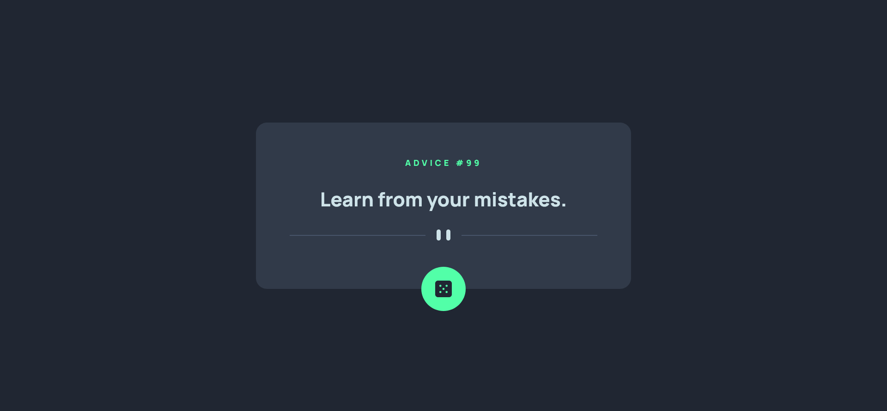

# Frontend Mentor - Advice generator app solution

This is a solution to the [Advice generator app challenge on Frontend Mentor](https://www.frontendmentor.io/challenges/advice-generator-app-QdUG-13db). Frontend Mentor challenges help you improve your coding skills by building realistic projects.

## Table of contents

- [Overview](#overview)
  - [The challenge](#the-challenge)
  - [Screenshot](#screenshot)
  - [Links](#links)
- [My process](#my-process)
  - [Built with](#built-with)
  - [What I learned](#what-i-learned)
- [Author](#author)


## Overview

### The challenge

Users should be able to:

- Click on the die button and receive a new advice slip.

### Screenshot



### Links

- Solution URL: [Solution code](https://github.com/nathanieladiah/advice)
- Live Site URL: [Solution site](https://nathanieladiah.github.io/advice/)

## My process

### Built with

- Semantic HTML5 markup
- CSS custom properties
- Flexbox
- Mobile-first workflow
- [React](https://reactjs.org/) - JS library


### What I learned

I used `React.useEffect()` to handle the api calls with a fetch:

```jsx
  React.useEffect(() => {
    fetch(	"https://api.adviceslip.com/advice")
    .then(response => response.json())
    .then(response => {
      setAdviceData(response);
      console.log(response);
    })
  }, [count])
```

The dependency array contains the `state` count which is updated to get new advice in the `onClick` event handler.

```jsx
  function getNewAdvice() {
    setCount(oldCount => oldCount + 1)
    console.log(count)
  }

<div className='advice__dice' onClick={getNewAdvice}></img></div>

```

I used a ternary operator to determine which image to use for the divider

```jsx
  
```

And I got the window dimensions using this function:
```jsx
  function getWindowDimensions() {
    const { innerWidth: width, innerHeight: height } = window;
    return {
      width,
      height
    };
  }

  export default function useWindowDimensions() {
    const [windowDimensions, setWindowDimensions] = React.useState(getWindowDimensions());

    React.useEffect(() => {
      function handleResize() {
        setWindowDimensions(getWindowDimensions());
      }
      window.addEventListener('resize', handleResize);
      return () => window.removeEventListener('resize', handleResize);
    }, []);
    return windowDimensions;
  }
```

And called it in `App.js`
```jsx
  const {height, width } = useWindowDimensions();
```

## Author

- Website - [Nathaniel Adiah](https://nathanieladiah.github.io)
- Frontend Mentor - [@nathanieladiah](https://www.frontendmentor.io/profile/nathanieladiah)
- Twitter - [@nathanieladiah](https://www.twitter.com/nathanieladiah)

